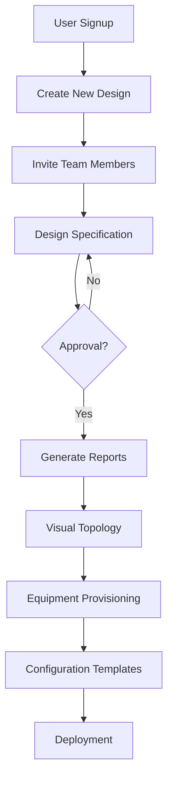

# Network Designer Pro
 A complete solution for your network design and planning needs.

 

**An end-to-end network design and implementation platform**  
[](https://network-designer-frontend.onrender.com/)  
[](https://github.com/sponsors/j-mugerwa)

## Key Features

| Feature | Status | Description |
|---------|--------|-------------|
| **Multi-stage Design** | ✅ Deployed | Guided workflow from topology design to implementation |
| **Automated Reporting** | ✅ Deployed | Generate professional PDF reports with 1 click |
| **Visual Topology Builder** | ✅ Deployed | Drag-and-drop network visualization |
| **Equipment Catalog** | ✅ Deployed | Custom device templates & auto-proposals |
| **Configuration Generator** | ✅ Deployed | Templated device configs with variables |
| **Team Collaboration** | ✅ Deployed | Real-time design collaboration |
| **Role-based Access** | 🚧 In Progress | Granular permission control |
| **Notifications** | 🚧 In Progress | Send and receive progress Notifications to team members |
| **Versioning** | 🚧 In Progress | Create and manage deployment versions in real time |
| **More Reports** | 🚧 In Progress | Generate more reports of choice |

## System Architecture



#  Demo Access

Test the deployed version with:

🔑 Email: yourschool20@gmail.com

🔒 Password: 1234567

(All demo data resets hourly)

#  Tech Stack
Frontend:

1. Next.js 15 + React 19

2. Redux Toolkit + RTK Query

3. Vis.js Network Topology

4. jsPDF + PDFKit

Backend:

1. Node.js + Express

2. MongoDB Atlas

3. Firebase for Authentication

4. Puppeteer (for PDF generation)

# Setup Guide
### 1. Create a .env file in your Backend and Frontend directories following the .env-example provided
### 2. Clone repository
git clone https://github.com/j-mugerwa/Network-Designer

### 3. Setup backend
```
cd Backend
npm install
npm run backend
```

### 4. Setup frontend

```
cd ../Frontend
npm install
npm run dev
```

#  Contribution Roadmap
## Team Collaboration Module (Priority)

Real-time design editing

1. Comment threads

2. @mentions


## Advanced Reporting

1. Custom report designer

2. Scheduled exports

# Contributors
Recognition Guidelines:

* First-time contributors: Added to "Contributors" list

* Major features: Profile + link in "Featured Contributors"

* Security fixes: Special acknowledgment

### Current Team:

- Joseph Mugerwa (Lead)

https://github.com/j-mugerwa/


# Sponsors
Support these amazing organizations:

<div align="center"> <a href="https://www.bugemauniv.ac.ug/">  </a> </div>


# Support the Project
Help us improve network automation!

[](https://github.com/sponsors/j-mugerwa)

"From topology to configuration in one platform"

📧 Contact: jmugerwa2020@gmail.com

© 2024 Network Designer Pro
